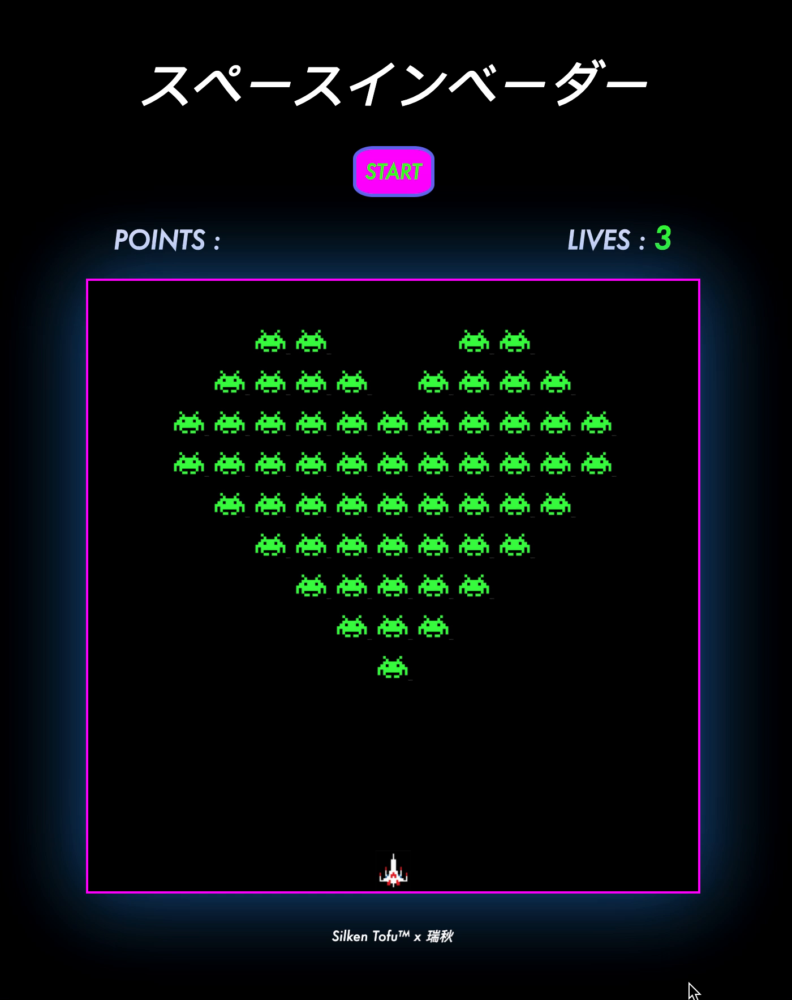

#  PROJECT 1 - SPACE INVADERS

## Overview 
SPACE INVADERS was my first (solo) project completed on General Assembly's Software Engineering Immersive, and was my first attempt at using JavaScript. 

I hugely enjoyed the creativity involved in this project and, once I figured out the logic, had a good time tinkering around with the design and sound effects. 

<!--  -->


## Play 
For the uninitiated, SPACE INVADERS is a classic 80s arcade game requiring the player (spaceship) to shoot down the invading aliens to score points before they reach the bottom of the screen. 

Play on GitHub Pages [here](https://cruickshankrpc.github.io/project-1/).

#### Controls
- Press the START button
- Move the spaceship LEFT (<-) and RIGHT (->) using the arrow keys. 
- Hit SPACEBAR to shoot.

## Brief 
Build a grid-based game that can render in the browser using HTML, CSS, & vanilla Javascript in **one week**.

## Technologies Used 
* HTML5
* CSS3
* JavaScript (ES6)
* Git/GitHub
* Google Fonts
* Paint

## Design 
I wanted to pay homage to the original game and use the Japanese title, pixelated game icons, and original soundtrack.\
Later, I added the flickering neon border; animations on the title, button, and signature; alien GIFs; fun sound effects. 

## Approach 

In order to break down the project I used the following questions: 
- What HTML and CSS classes will you need to display your game?

- What data types will you need to represent your game state in javascript? What Arrays, objects, numbers etc.?

- What DOM elements will you need to select in javascript?

- What's the MVP (minimum viable product) of my game?

- What are the discrete pieces of functionality my MVP will need to have, piece by piece?

- For each piece, what loops/conditions/functions/intervals will I need to handle that piece? How does my game state change to make this work? How will the DOM need to change?

- How do I make this more simple?

- What challenges will I run into? How do I handle those?

### MVP

In order to ensure I had a working product by the deadline - I decided to have my MVP ready by the end of day 3. This would be the bare bones of the game:
- A container with grids for game components 
- Moving and shooting player spaceship
- Aliens that explode on impact with laser & move toward the bottom of the screen
- Points board 
- Lives board 
- Gameover 
- Styling 

### Stretch 
- Aliens drop bombs at random intervals 
- Animations 
- Sound effects 
- Styling flourishes (aliens in heart formation, Japanese title etc)
- Levels

## Process 

### DAY 1

- Pseudocode MVP
- Create grid using a for loop & flexbox:

```Javascript 
  // Create 225 cells 
  for (let i = 0; i < width ** 2; i++) {
    // create my cell
    const div = document.createElement('div')
    // add class of cell
    div.classList.add('cell')
    // appended cell to page
    grid.appendChild(div)
    cells.push(div)
  }
```
- Render player 

### DAY 2
- Define aliens
- Player movement and laser logic:
```Javascript

    function shootLaser() {
      let laserPosition = playerPosition
      const laserID = setInterval(() => {

        cells.forEach(cell => cell.classList.remove('laser'))

        // remove laser at end of grid
        if (laserPosition < width) {
          clearInterval(laserID)
          cells[laserPosition].classList.remove('laser')
          return
        }

        // move laser up the grid
        laserPosition -= width
        cells[laserPosition].classList.add('laser')

        // if laser hits alien...
        aliens.forEach(alien => {
          if (alien === laserPosition) {
            clearInterval(laserID)
            alienHit.play()
            cells[laserPosition].classList.remove('alien')
            cells[laserPosition].classList.remove('laser')
            cells[laserPosition].classList.add('explode')
            setTimeout(() => {
              cells[laserPosition].classList.remove('explode')
            }, 500)
            aliens.splice(aliens.indexOf(alien), 1)
            points += 5
            pointsDisplay.innerHTML = points
          }
        })
      }, 100)
    }
  }
```

### DAY 3
Alien movement logic:
```Javascript
  function moveAliens() {
    const aliensID = setInterval(() => {
      // if going right : 
      if (alienDirection === 'right') {
        // if you hit the right border...
        if (aliens.some(alien => alien % width === width - 1)) {
          addAliens()
          for (let i = 0; i < aliens.length; i++) {
            // go down a row...
            aliens[i] += width
          }
          removeAliens()
          addAliens()

          // ...then go left 
          alienDirection = 'left'

        } else {
          removeAliens()
          // loop over array adding one to move aliens right 
          for (let i = 0; i < aliens.length; i++) {
            aliens[i] += 1
          }
          // add aliens 
          for (let i = 0; i < aliens.length; i++) {
            addAliens()
          }
        }

      } else if (alienDirection === 'left') {
        if (aliens.some(alien => alien % width === 0)) {
          addAliens()
          for (let i = 0; i < aliens.length; i++) {
            aliens[i] += width
          }
          removeAliens()
          addAliens()

          // then go right 
          alienDirection = 'right'

        } else {
          removeAliens()
          // loop over array adding one to go left 
          for (let i = 0; i < aliens.length; i++) {
            aliens[i] -= 1
          }
          for (let i = 0; i < aliens.length; i++) {
            addAliens()
          }
        }
      }
```
### DAY 4 
- Points board
- Styling
- Animate exploding aliens
- Endgame function
- Debugging


### DAY 5
- Debugging 
- Sound effects
- Animated Silken Tofu signature


## Wins 
- Styling - overall pretty chuffed with the look and feel of the game. 
- Got my MVP !
- Functionality is pretty smooth - managed to iron out most of the bugs with the shooting and exploding aliens. 

## Bugs 
**Note: Fixed these bugs post-course 💁🏻‍♀️**
- Sometimes the game gets stuck after gameover and doesn't refresh.
- Sometimes the game doesn't end even when you've lost all your lives !

## Learned
- Alien movement logic - defining the borders and rendering the aliens was a little complicated. I should have liked to refactor this code time permitting. 
- Random bomb drops - using setInterval and setTimeout to choose a random time AND a random alien to assign the bomb.
- SCOPE - learned first hand about local and globally accessible functions. 

## Future Features 

- Cover page before you start the game.
- Alerts for 'Gameover' & 'You win' as styled pop outs.
- LEVELS that increase in difficulty with different aliens.
- Sound OFF button. 
- PAUSE game button. 
- 'About' popup.
- Mobile responsive !
